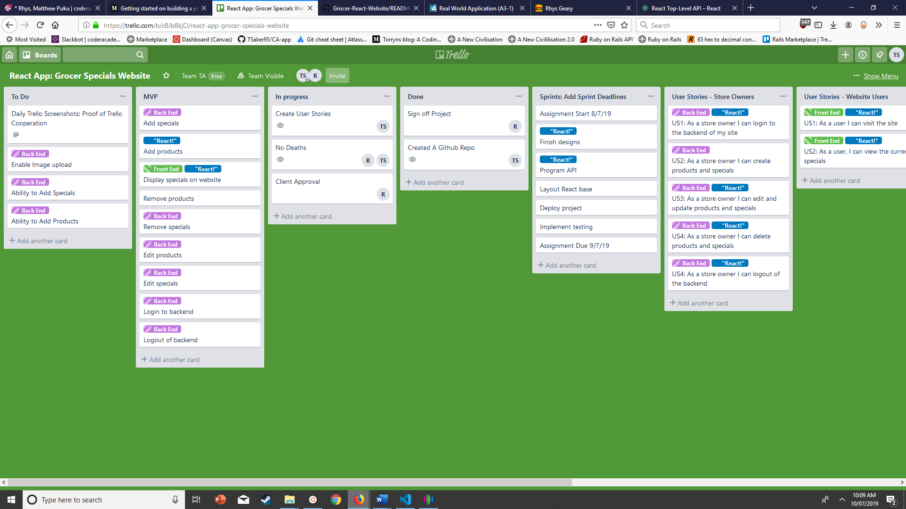
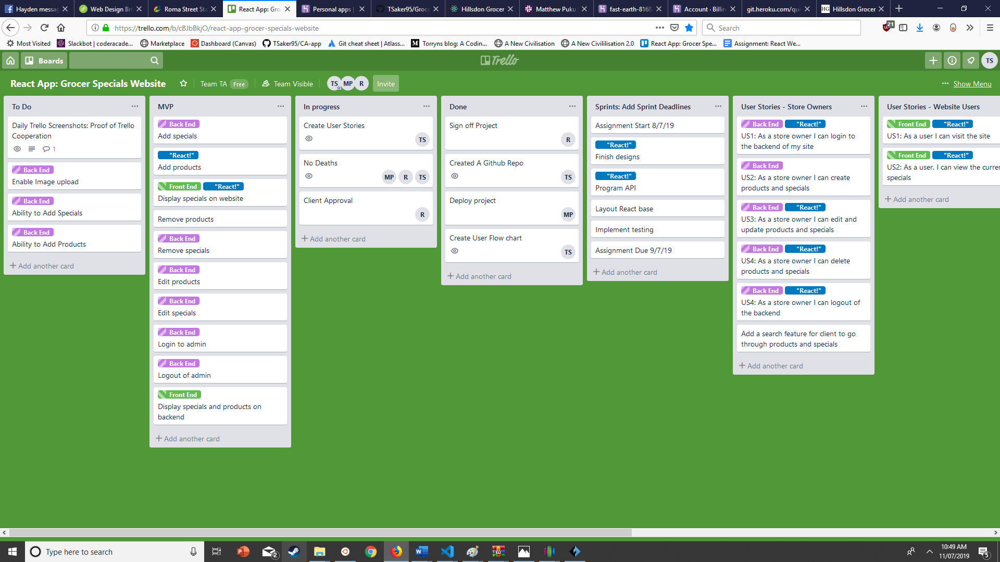
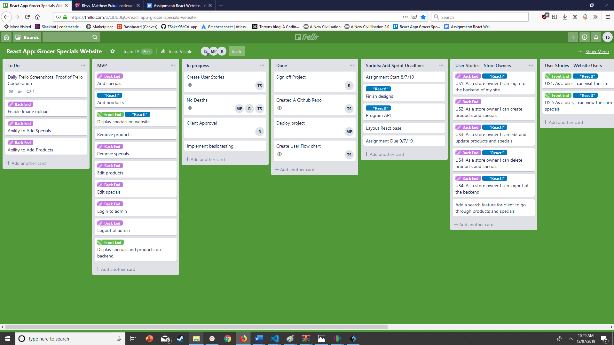
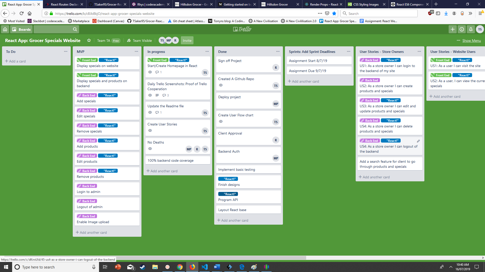
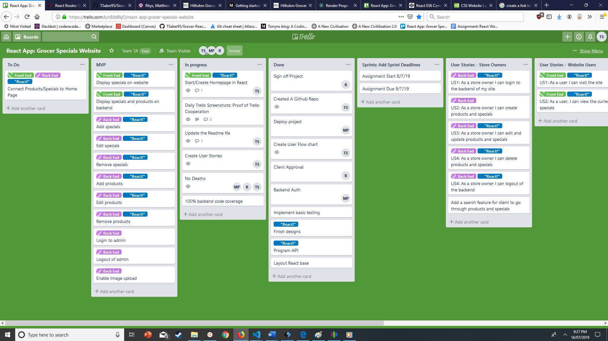
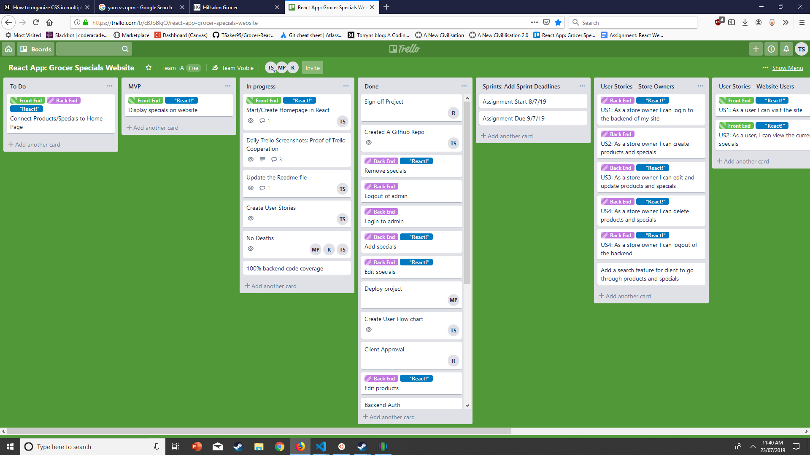
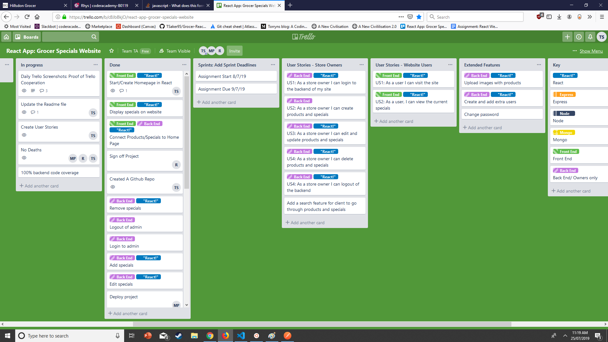

<!-- A link (URL) to our published App:  -->

---------------------------------------------------------------------------

<!-- A link to your GitHub repository:  -->

https://github.com/TSaker95/Grocer-React-Website 
--------------------------------------------------------------------------- 

<!-- Description of our project: -->
    
#Problem definition / purpose:

Hillsdon Grocer currently has a simple, static website. While this fulfills most of their needs, they would like something more dynamic allowing them to better publicise products on sale. Ideally, they would like to be able to fill out a title, description and sale price and have it automatically displayed on their website.

#Functionality / features

Our solution to this is to create a login portal which then leads them to a dashboard showing current specials as well as ways to create, edit and delete specials. Once saved the current specials will be rendered on their website.

#Screenshots

#Tech stack (e.g. html, css, deployment platform, etc)

The client side of the website will be built in React using create-react-app. The backend will use Node.JS, Express and data will be stored in a Mongo database.
        
#Instructions on how to setup, configure, deploy and use your App:

- Download or clone this repo to your local machine
- yarn install
- yarn dev (to run app in development mode)
- yarn build (to build files for production mode)
- yarn start (to run app in production mode)

In dev mode, the frontend will run on localhost:3000 and the backend on localhost:4000. In production, the backend will serve the prebuilt frontend to the browser, so go to localhost:4000 to see the results.

---------------------------------------------------------------------------

<!-- Design documentation including:  -->

#Design process

#User stories

#A workflow diagram of the user journey/s.

#Wireframes

#Database Entity Relationship Diagrams

#Data Flow Diagram

#OO design documentation

--------------------------------------------------------------------------- 

<!-- Details of Project Management & Planning process:  -->
#Project plan & timeline

#Client communications

#Screenshots of Trello board: 

(Note: Links are updated each day, or that day.)    
---------------------------------------------------------------------------
    
    
<!-- Answers to the Short Answer questions: (Section 2.2) -->

    A: What are the most important aspects of quality software?

    B: What libraries are being used in the app and why?

    C: A team is about to engage in a project, developing a website for a small business. What knowledge and skills would they need in order to develop the project?
    
    
    D: Within your own project what knowledge or skills were required to complete your project, and overcome challenges?
    
    
    E: Evaluate how effective your knowledge and skills were this project, using examples, and suggest changes or improvements for future projects of a similar nature?

 --------------------------------------------------------------------------- 
    
  

 